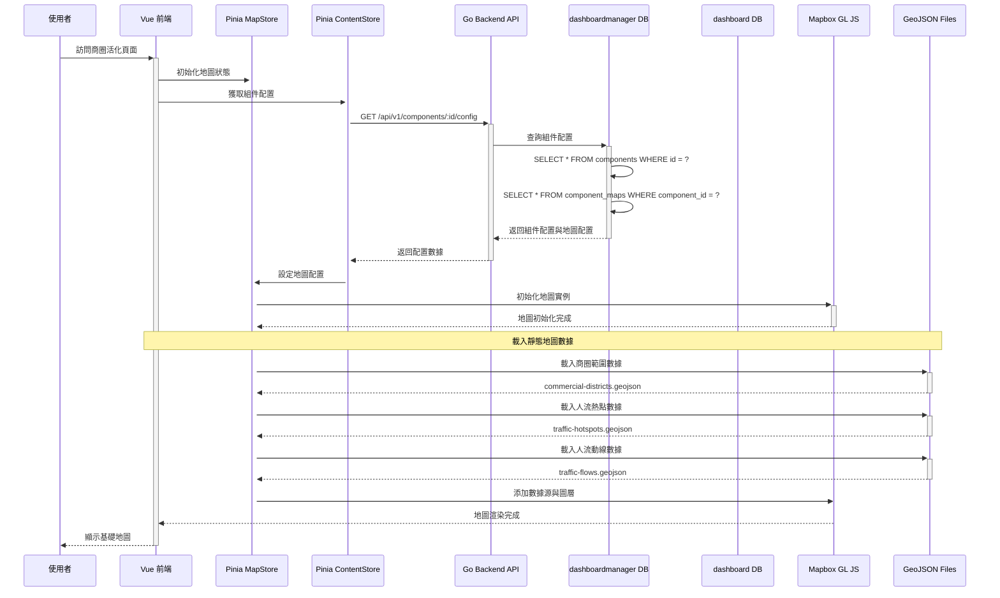
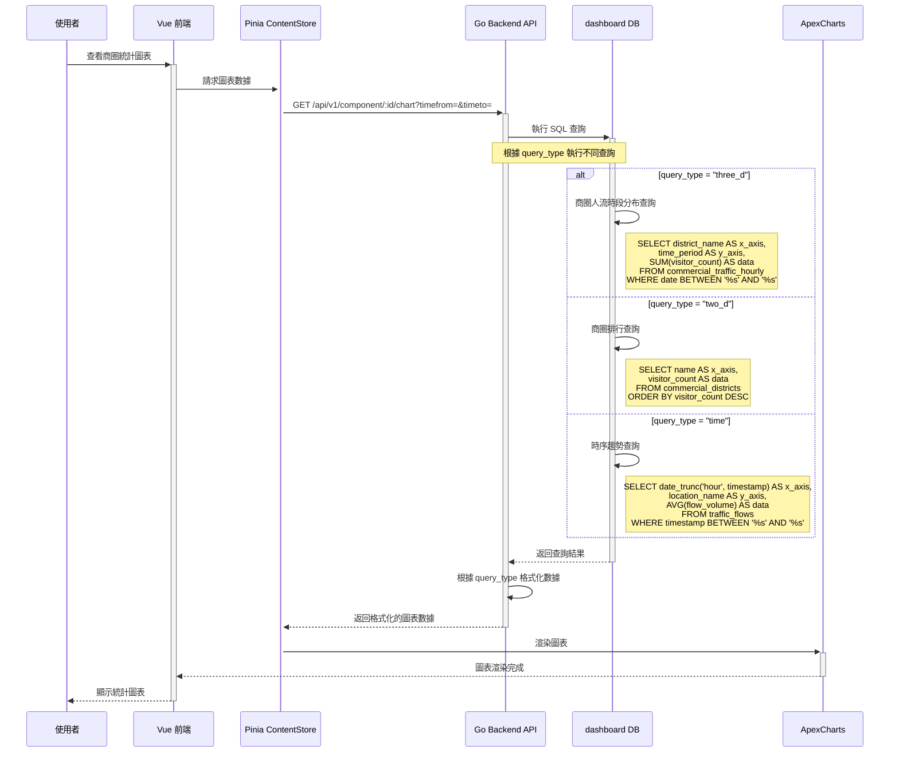
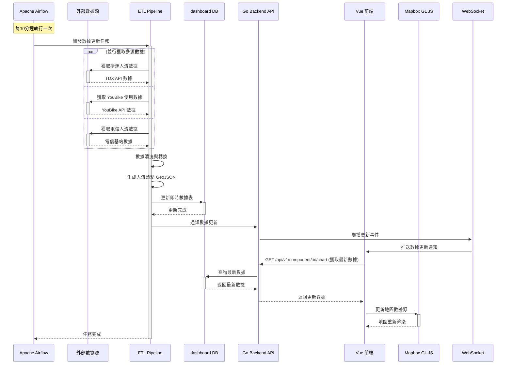
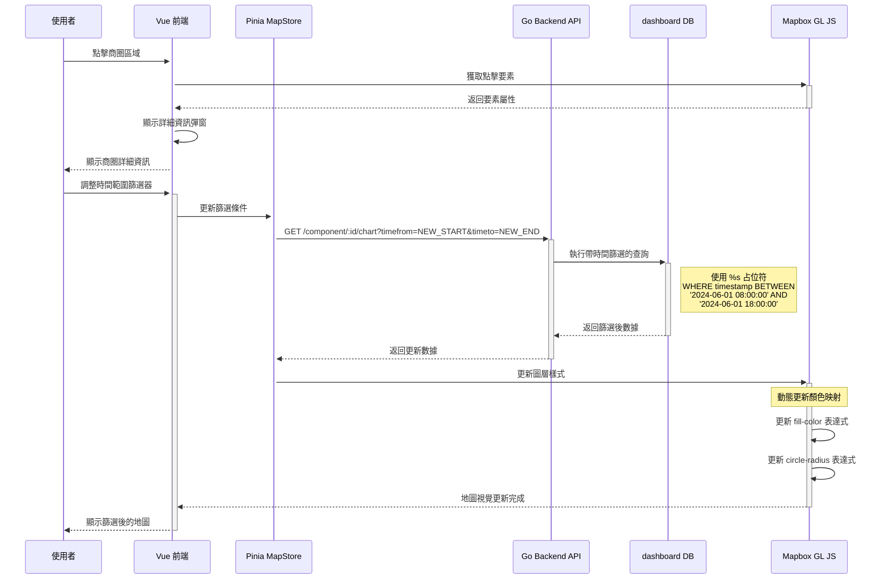
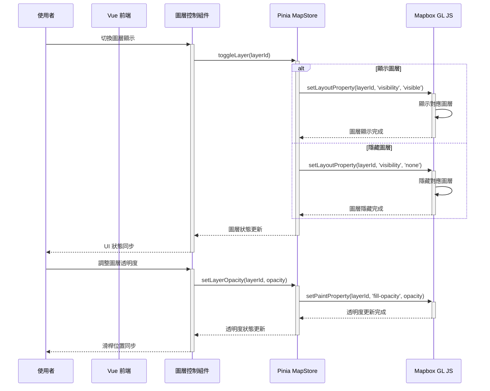

# 台北城市儀表板 - 前後端串接循序圖

## 商圈活化地圖功能完整交互流程

### 1. 系統初始化與地圖載入流程



### 2. 動態數據載入與圖表渲染流程



### 3. 即時數據更新流程



### 4. 用戶交互與篩選流程



### 5. 圖層控制與視覺化切換流程



### 6. 錯誤處理與重試機制

```mermaid
sequenceDiagram
    participant FE as Vue 前端
    participant API as Go Backend API
    participant DB_Data as dashboard DB
    participant ErrorHandler as 錯誤處理器
    participant Logger as 日誌系統

    FE->>+API: GET /api/v1/component/:id/chart
    API->>+DB_Data: 執行 SQL 查詢

    alt 資料庫連接失敗
        DB_Data-->>-API: 連接錯誤
        API->>+ErrorHandler: 處理資料庫錯誤
        ErrorHandler->>+Logger: 記錄錯誤日誌
        Logger-->>-ErrorHandler: 日誌記錄完成
        ErrorHandler->>ErrorHandler: 執行重試機制 (最多3次)
        ErrorHandler-->>-API: 重試結果

        alt 重試成功
            API-->>FE: 返回數據
        else 重試失敗
            API-->>FE: HTTP 500 + 錯誤訊息
            FE->>FE: 顯示友善錯誤訊息
        end

    else SQL 語法錯誤
        DB_Data-->>-API: SQL 執行錯誤
        API->>+Logger: 記錄 SQL 錯誤
        Logger-->>-API: 記錄完成
        API-->>FE: HTTP 400 + 錯誤詳情
        FE->>FE: 顯示「數據載入失敗」

    else 正常執行
        DB_Data-->>-API: 返回查詢結果
        API-->>-FE: HTTP 200 + 數據
    end
```

## 關鍵技術要點

### 1. 數據流架構

- **靜態數據**：GeoJSON 檔案，用於基礎地理圖形
- **動態數據**：透過 API 獲取，支援時間篩選
- **即時數據**：WebSocket 推送，10 分鐘更新週期

### 2. SQL 查詢類型對應

- `two_d`: 二維圖表 (排行榜、分布圖)
- `three_d`: 三維圖表 (熱力圖、分類統計)
- `time`: 時序圖表 (趨勢分析)
- `percent`: 百分比圖表 (佔比分析)
- `map_legend`: 地圖圖例數據

### 3. 效能優化策略

- **前端快取**: Pinia store 5 分鐘快取
- **資料庫索引**: 地理空間索引 + 時間索引
- **分層載入**: 根據縮放級別載入不同精度數據

### 4. 錯誤處理機制

- **自動重試**: 最多 3 次重試
- **友善提示**: 使用者友好的錯誤訊息
- **日誌記錄**: 完整的錯誤追蹤

### 5. 安全性考量

- **SQL 注入防護**: 使用參數化查詢
- **API 認證**: JWT Token 驗證
- **CORS 設定**: 限制跨域請求來源
